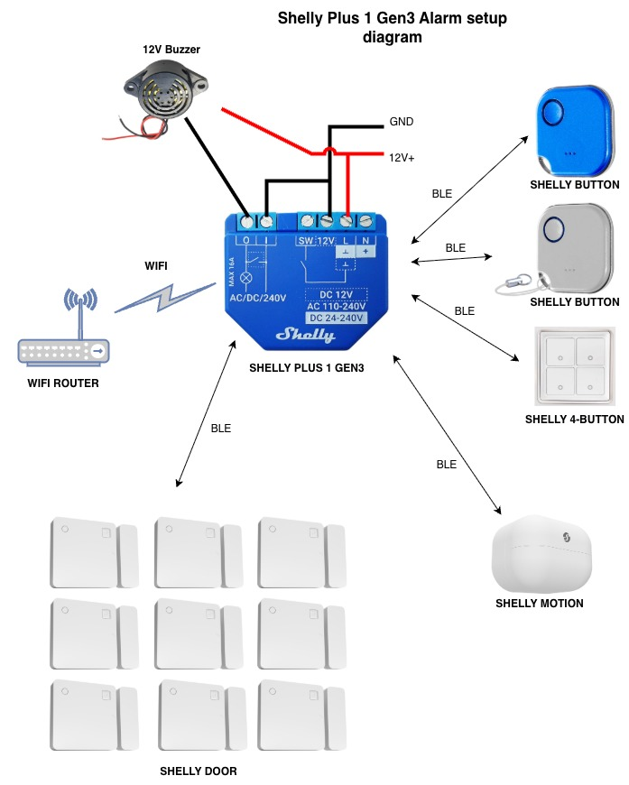

# Shelly Autocaravan Alarm

A smart, low-power alarm system for **autocaravans, motorhomes and campervans**, built on the **Shelly Plus 1 Gen3/Gen4** and **Shelly BLU** wireless devices.

The system runs entirely on the Shelly device itself (mJS scripting runtime) — no external server, no proprietary hub, no subscription. Wireless BLE sensors trigger a local buzzer and a priority push notification to any number of phones via the free Shelly Cloud.

We use it ourselves. It works just fine. You're welcome to adapt it to your own setup.

> 🔓 **Open source.** No warranty, no lock-in, no proprietary cloud. Use it freely, modify it, improve it.

---

## Two paths — pick yours

There are two ways to get this system running in your van:

### 🛠️ Path 1 — Do it yourself

**Here is the code for it.** Everything is in this repository: the alarm scripts (Simple and Advanced versions) and the system diagram you'll need to install it all yourself.

This path is for you if:
- You're comfortable with Shelly devices and their web UI
- You can read and adapt a small JavaScript-like script
- You don't mind sourcing the hardware (Shelly Plus 1 + BLU sensors + buttons + buzzer + 12V wiring) yourself
- You know how to setup the needed KVS parameter holders using the interface for this
- You like having full control and full transparency of everything.

→ Jump to **[How it works](#how-it-works)** and **[Installation](#installation)** below.

### 📦 Path 2 — Or let us assist you

**Prefer a ready-made kit?** We can prepare everything to your specific needs — pre-flashed gateway, pre-configured sensors paired to your devices, cloud scenes ready to go, all in a wired box with buzzer and a fused 12V cable. You receive it, install it in your van, and we make sure it's working on day 1 with up to 1.5 hours of remote setup assistance. 

This path is for you if:
- You'd rather not flash firmware or fiddle with KVS keys
- You want the components selected and configured for your specific vehicle
- You value the time it would take you to do this yourself
- You'd like someone to be on the other end of an email if something doesn't behave

More assistance may be bought if needed later. If the needs change or stop working. 
E.g. you have purchased the Basic setup but want to change this to include the "dog inside / while we sleep" features of the advanced setup. 
We can change the system remotely later to meet that need. If you buy your own additional devices that does not work as expected, we may assist. The additional devices offered here are priced to include the needed pre-configuration and inclusion in your system. 

→ Jump to **[Commercial edition — pricing](#commercial-edition--pricing)** below.

**Either path uses the exact same hardware and the same open-source code.** You can switch from Path 2 back to Path 1 at any time — the commercial edition is just the open-source code in a finished box, and you're free to inspect, modify or replace it whenever you like.

---

## How it works



The diagram above shows the overall topology. Numbers and types of devices can be adjusted to your specific needs.

### Gateway

The "brain" of the system is the **Shelly Plus 1 Gen3** (or Gen4) — it runs the alarm script, interconnects with Wi-Fi, the cloud and the BLE sensors, and controls the buzzer (or whatever you wire to its relay).

- [Shelly Plus 1 Gen3](https://www.shelly.com/products/shelly-1-gen3)

### Sensors

We wanted every door and window protected. For that we used the **Shelly BLU Door/Window** sensor:

- [Shelly BLU Door/Window](https://www.shelly.com/products/shelly-blu-door-window-zb-white)

We also wanted the inside of the van protected against movement, in case someone bypassed the door sensors. For that we used the **Shelly BLU Motion** sensor:

- [Shelly BLU Motion](https://www.shelly.com/products/shelly-blu-motion)

Many other Shelly BLU sensor types can be added — this is just a typical setup.

### Controllers

To control the system we use keyring buttons — one per family member. The "Tough" buttons are the current sturdy version (the older "flimsy" buttons are now retired):

- [Shelly BLU Button Tough](https://www.shelly.com/products/shelly-blu-button-tough-1-ivory)

For "Night sleep mode" (or "Dog home alone mode") we added a 4-button BLU device we already had controlling other things in the van (a lamp that's annoying to turn off at night). It lets you disarm without having a keyring button within reach — useful when reachable from the bed:

- [Shelly BLU Wall Switch 4](https://www.shelly.com/products/shelly-blu-wall-switch-4-stand-alone-bundle)

Any Shelly controller works to operate the system.

### Action / alerting

We decided against using a car horn — our experience is that horns don't really discourage thieves, and they cause enormous amounts of annoyance during misfires.

We added a **simple buzzer** to inform audibly what's happening. In a real compromise it sounds a "quiet but noticeable" alarm to let the thief know they're busted. Combined with our camera system, they'll most likely leave to avoid further problems.

The buzzer can be replaced by a relay controlling whatever you want. We're considering a fog system — people definitely notice "a van on fire covered in smoke", and the thieves can't see anything either way. It's up to you to decide what should happen — **you will always be alerted on your phone unless the Wi-Fi network is blocked.**

### Connectivity

The gateway uses Wi-Fi to alert externally. The system runs autonomously without internet, a router in the van is required for the system to work properly.

The sensors all connect to the gateway over **BLE (Bluetooth Low Energy)**. Shelly says the coverage distance is up to 75 m. We only need 10-15 for a van 🙂

The gateway needs a **12 V supply** and consumes about **1.2 W**. With a 100 Ah battery that's more than a month of operation. Add the typical 10 W usage of a router and the entire system will still work for many days any supporting electrical systems. With our 120 W solar panel there is no noticeable consumption when sunlight is available (self-sustaining 100 %).

### Weak points (be honest)

- If someone jams the Wi-Fi *and* BLE frequencies, the system fails
- If a thief learns your activation key and hacks the system locally (parked next to you), the system fails
- The Shelly hardware is not industrial-grade and can fail
- The alarm script is not ISO 27001-certified and not bulletproof

### Weak points countermeasures:
- If someone jams the Wi-Fi *and* BLE frequencies, the system fails BUT:
  - With the purchased model we include a watchdog monitor of the system so you are informed if the gateway does not respond for half an hour (may be adjusted). That way you always know if the connection to the system fail
- If a thief learns your activation key and hacks the system locally (parked next to you), the system fails
  - The thief have to guess your password and know which system to hack while sitting close top the van. Highly unlikely
- The Shelly hardware is not industrial-grade and can fail
  - And is cheap to replace :-)
- The alarm script is not ISO 27001-certified and not bulletproof
  - But it does not cost a foutune either.

We find it useful anyway and live withe the risks.

### Summary of the system

- **Shelly Plus 1 Gen3** is wired to a **12 V buzzer** via its relay output and a 12 V supply (GND + 12V+).
- **Wi-Fi** connects the Shelly device to a router, providing internet access for Shelly Cloud scene calls (alarm push, armed/disarmed notifications).
- **Watchdog** In the commercial solution we include an external watchdog monitoring the availability of the system externally.
- **BLE** receives events from BLU devices in range:
  - **Shelly BLU Tough Button** — primary user controls (arm/disarm)
  - **Shelly BLU 4-Button** (v2 only) — additional control surface mounted inside the van permanently
  - **Shelly BLU Door/Window** sensor(s) and **Shelly BLU Motion** sensor — the alarm triggers - More may be added later (Smoke alarm, Gas alarm, Flood sensor... Shelly have many interesting devices in their portfolio)

There are no wires between the Shelly Plus 1 Gen3 and the BLU devices — all sensor and button events arrive as Bluetooth Low Energy advertisements that the script's BLE scanner picks up and parses (BTHome v2). In our experience the batteries last longer than a year so far - We will keep you updated on this as time goes by.

---

## Two script versions

| Version | Modes | For |
|---|---|---|
| **`v1-simple/alarm-v1.3.0.js`** | ARM / DISARM / ALERT | A normal alarm system |
| **`v2-advanced/alarm-v2.1.0.js`** | ARM / DISARM / **SLEEP** / ALERT | Adds a "perimeter only" sleep mode for dogs or overnight stays inside the van |

The advanced version is for people with pets and the need to secure the perimeter while inside the van. We don't have a dog, and we're not afraid that someone would climb into our van while we're asleep, so we use the Simple edition.

### Activation patterns

The system is controlled with button click patterns. This is 100 % customizable — the pattern below is what we use (default):

| Pattern | Action |
|---|---|
| Single short click | Activate the alarm |
| Double short click | Deactivate the alarm in any state |
| Triple short click | Activate "SLEEP" mode when disarmed (Advanced only) / Deactivate when armed |
| Single long click | Deactivate the alarm in any state |

To arm: single short click. To arm in SLEEP mode: triple click (when system is disarmed) — Advanced only. To disarm: double, triple (not advanced mode), or long click (our preference).

### Alarm sounds (buzzer)

When armed by single click, the buzzer plays a series of beeps with shorter and shorter delays (default 10 s) — system is almost armed. Then a long continuous warning beep. Then the system is armed, silent and watching for intruders.

- **Re-arming (already armed):** short confirmation beep
- **Disarming (double / triple (not advanced)/ long click):** long double beep
- **Sleep mode armed:** single beep to avoid waking the dog.

**A long double beep always confirms deactivation.**

---

## Repository layout

```
shelly-autocaravan-alarm/
├── README.md                               ← This file
├── Shelly_Autocaravan_Alarm_Flyer_v1_1.pdf ←  Commercial description and pricing
├── Shelly_alarm.jpg               ← reference diagram (above)
├── v1-simple/
│   └── alarm-v1.3.0.js            ← single-mode alarm
└── v2-advanced/
    └── alarm-v2.1.0.js            ← + sleep mode, dual scene
```

---

## Installation

1. Open the Shelly Plus 1 Gen3 web UI (`http://<device-ip>`).
2. Go to **Scripts → Add script**.
3. Paste the contents of `v1-simple/alarm-v1.3.0.js` or `v2-advanced/alarm-v2.1.0.js`.
4. Populate the needed KVS keys for your environment as described in the code.
5. **Save → Start → enable "Run on startup"**.

The script will run with the baked-in defaults if KVS is empty — useful for first install. Once KVS is populated, the script picks up those values on the next startup.

---

## Configuration: KVS soft fallback

Both scripts use a soft-fallback configuration strategy. At startup the script reads its config from the device's **Key-Value Store (KVS)**. If a key is missing, the script falls back to baked-in defaults defined in the script's `DEFAULTS` block.

This lets you keep secrets (cloud auth key, scene IDs) and device-specific MAC addresses on the device itself, rather than in the committed source code.

### KVS keys read at startup

| Key | Type | Purpose | Used by |
|---|---|---|---|
| `cfg.cloud_server` | string | Shelly Cloud hostname (e.g. `shelly-XX-eu.shelly.cloud`) | both |
| `cfg.cloud_auth` | string | Shelly Cloud auth key | both |
| `cfg.scene_alarm` | number | Scene ID for the priority alarm push | both |
| `cfg.scene_armed` | number | Scene ID for "armed" notification push | both |
| `cfg.scene_disarmed` | number | Scene ID for "disarmed" notification push | both |
| `dev.buttons` | string (CSV) | MAC addresses of single BLU Button devices | both |
| `dev.sensors` | string (CSV) | MAC addresses of all alarm-triggering BLU sensors | both |
| `dev.buttons4` | string (CSV) | MAC of the 4-button BLU device | v2 only |
| `dev.sleep_sensors` | string (CSV) | Subset of sensors that remain active in sleep mode | v2 only |

The runtime key `alarm_state` is also written by the script to mirror the current state (`disarmed` / `arming` / `armed` / `armed_away` / `armed_sleep` / `alarming`).

---

## Cloud setup

Three cloud scenes in the Shelly Smart Control app:

| Scene | Purpose |
|---|---|
| **Alarm** | Priority push when intruder detected — must have a (dummy) BLU device as its trigger, stays armed (green shield) in the app |
| **Armed notification** | Informational "system armed" push |
| **Disarmed notification** | Informational "system disarmed" push |

The script invokes each scene via `/scene/manual_run` over HTTPS. Scene IDs are stored in KVS.

---

## Remote control endpoints (local network)

```
http://<device-ip>/rpc/Script.Eval?id=<script-id>&code=armRemote()
http://<device-ip>/rpc/Script.Eval?id=<script-id>&code=armSleepRemote()  (v2 only)
http://<device-ip>/rpc/Script.Eval?id=<script-id>&code=disarmRemote()
http://<device-ip>/rpc/Script.Eval?id=<script-id>&code=sendStatus()
http://<device-ip>/rpc/KVS.Get?key=alarm_state
```

These can be bookmarked on phone home screens for one-tap control. If you enable web UI authentication in the device settings, bookmarks need basic-auth credentials embedded.

---

## Hardware

Everything you need to source if you're going the DIY route:

- **Shelly Plus 1 Gen3** — runs the script, drives the buzzer relay
- **12 V buzzer** wired to the Shelly's relay output (audible local alarm) — replace with whatever output device you prefer
- **Shelly BLU Tough Button** — primary user controls (single-click to arm, long/double/triple press to disarm)
- **Shelly BLU 4-Button** (v2 only, optional) — additional control surface
- **BLU sensors** (door/window, motion, etc.) — the alarm triggers
- **One "dummy" BLU Door/Window sensor** kept permanently closed — required by Shelly's alarm scene UI to satisfy the "scene must have a trigger device" rule
- **12 V supply cables** with appropriate fusing

See the reference diagram at the top of this README for the physical topology.

---

## Commercial edition — pricing

If you'd rather not source and configure everything yourself, we offer a **pre-configured, ready-to-install kit**. Same open-source code, same hardware — already wired into a box with buzzer and fused 12V cable, sensors paired and ready, cloud scenes installed.

**Pricing is 100 % transparent** and covers hardware at cost plus the time it takes us to configure your specific setup. No subscription, no recurring fees — just a one-off setup fee for your custom build.

All kits include **up to 1.5 hours of remote setup assistance** to make sure you're working on day 1.

### Kits

| Tier | What's included | Best for | Price |
|---|---|---|---|
| **Base Simple** *(gateway only)* | Shelly Plus 1 Gen3/4 pre-flashed • Box with buzzer + fused 12 V cable • Cloud scenes + 1 h remote online setup assistance | DIY builders adding their own sensors as needed | **€100** |
| **Model 1** *(Simple — Small)* | Base Simple kit + 2× door/window sensors + 1× motion sensor + 2× tough key-ring buttons | Standard vans with 2 doors and one surveillance zone. Fundamental and safe | **€200** |
| **Model 2** *(Simple — Medium)* | Base Simple kit + 5× door/window sensors + 1× motion sensor + 3× tough key-ring buttons | Larger motorhomes with multiple doors and three controllers included | **€300** |
| **Base Advanced** *(gateway + sleep mode)* | Everything in Base Simple + Advanced firmware with SLEEP mode + up to 1.5 h online setup | Owners with pets that need perimeter only, or wanting overnight perimeter addition | **€150** |
| **Model 3** *(Advanced — Small)* | Base Advanced kit + 2× door/window sensors + 1× motion sensor + 2× tough key-ring buttons | Same as Model 1 but with the advanced dual configuration — for dog owners and hard sleepers wanting night alarm | **€250** |
| **Model 4** *(Advanced — Large)* | Base Advanced kit + 5× door/window sensors + 1× motion sensor + 3× tough key-ring buttons | The full kit for family rigs needing sleep mode / non-pet trigger — can be expanded with more devices as needed | **€350** |

### Add-on devices

Configured and added to any kit:

| Device | Price |
|---|---|
| Door/window sensor |***€25 each*** |
| Motion sensor | ***€30 each*** |
| Tough button | ***€25 each*** |
| 4-button | ***€25 each*** |

### Shipment

The complete set is configured and shipped using any appropriate agency. **Quote on request** based on destination.

### Get yours

Email **niels@niels.es** for a shipping quote or a custom configuration. Shipped worldwide.

---

## Use on your own discretion

These scripts are submitted as open source for you to use as you want. Suggestions and corrections are very welcome.

**Use at your own discretion and risk.** No warranty. Personal use.

If you go the commercial-edition route, you can replace it with the open-source edition at any time and remain in full control. You own the hardware, you own the configuration, you own the code.
